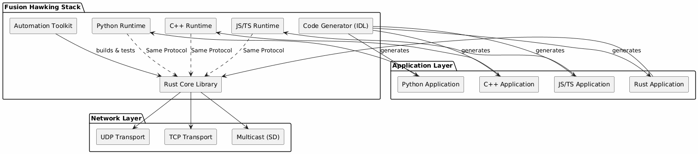
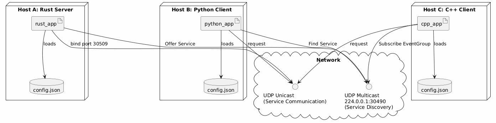
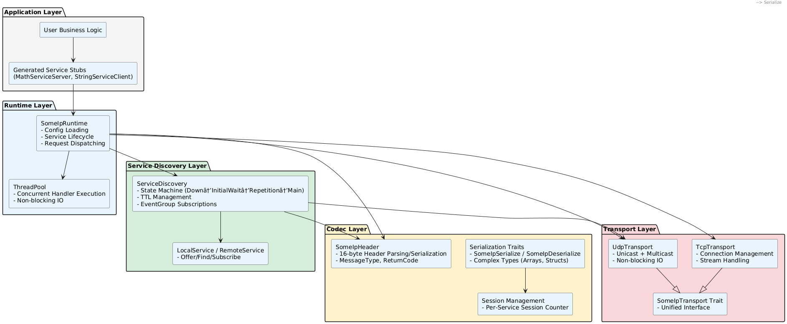
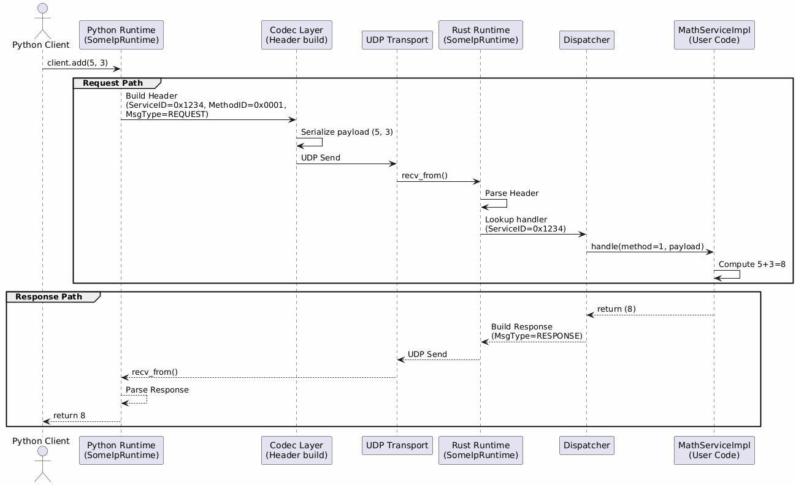
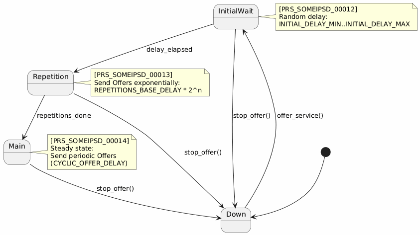
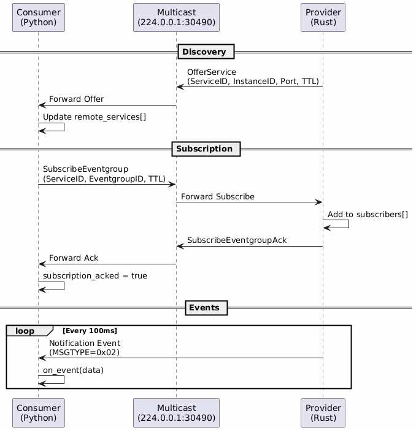
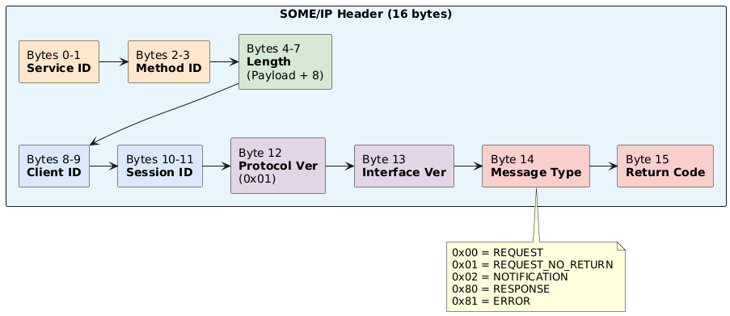
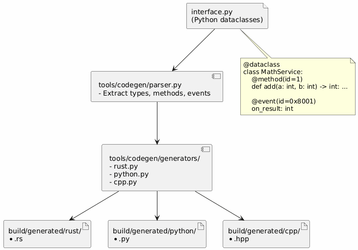
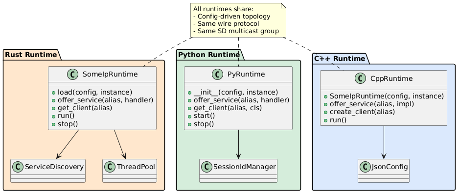
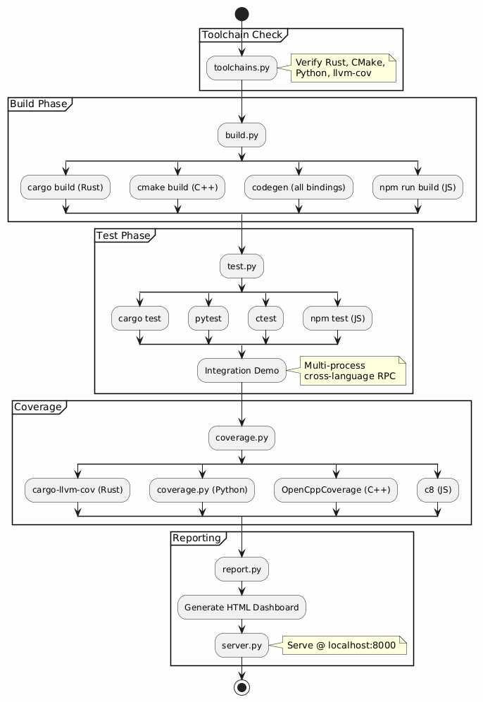

# Fusion Hawking Architecture

> **See Also:** [User Guide](user_guide.md) | [IDL Reference](IDL.md) | [Design Doc](design_and_requirements.md) | [Test Matrix](test_matrix.md)

This document provides a comprehensive view of the Fusion Hawking SOME/IP stack architecture, including deployment topology, internal layers, data flows, and component interactions.

> **Note:** Diagrams are auto-generated from [PlantUML sources](diagrams/). Run `.\fusion.bat` to regenerate after edits.

---

## High-Level System Overview

Fusion Hawking is a **lightweight, dependency-free SOME/IP library** implemented primarily in Rust, with native bindings for Python and C++. The stack adheres to the AUTOSAR SOME/IP and SOME/IP-SD protocol specifications.

View PlantUML Source

[system_overview.puml](diagrams/system_overview.puml)

---

## Deployment Topology

Applications can be deployed anywhere on the network. Service Discovery enables dynamic peer detection across hosts. Configuration-driven deployment allows runtime port binding without recompilation.

View PlantUML Source

[deployment_topology.puml](diagrams/deployment_topology.puml)

> **Configuration Schema:** See [Design Doc - JSON Configuration](design_and_requirements.md#2-json-configuration-schema)

---

## Layered Architecture

The stack follows a clean layered architecture with strict separation of concerns:

View PlantUML Source

[layered_architecture.puml](diagrams/layered_architecture.puml)

---

## Request/Response Data Flow

This diagram shows the complete data flow for an RPC call from a Python client to a Rust server:

View PlantUML Source

[request_response_flow.puml](diagrams/request_response_flow.puml)

> **API Usage:** See [User Guide - Runtime API](user_guide.md#runtime-api)

---

## Service Discovery State Machine

The SD layer implements the AUTOSAR-specified state machine for service lifecycle per [PRS_SOMEIPSD_00011-00014]:

View PlantUML Source

[sd_state_machine.puml](diagrams/sd_state_machine.puml)

---

## Subscription Flow

View PlantUML Source

[subscription_flow.puml](diagrams/subscription_flow.puml)

> **Event Definitions:** See [IDL - Events](IDL.md#events-pubsub)

---

## SOME/IP Message Format

The 16-byte header structure per AUTOSAR PRS_SOMEIP:

View PlantUML Source

[someip_header_format.puml](diagrams/someip_header_format.puml)

> **Serialization Details:** See [IDL - Serialization](IDL.md#serialization-details)

---

## Code Generation Pipeline

The IDL compiler generates type-safe bindings for all supported languages:

View PlantUML Source

[codegen_pipeline.puml](diagrams/codegen_pipeline.puml)

> **Full IDL Reference:** See [IDL Documentation](IDL.md)

---

## Cross-Language Runtime Architecture

Each language runtime provides the same API semantics:

View PlantUML Source

[cross_language_runtimes.puml](diagrams/cross_language_runtimes.puml)

> **Logging Interface:** See [Design Doc - Logging](design_and_requirements.md#3-logging-abstraction-dlt-ready)

---

## Automation & CI/CD Pipeline

The `tools/fusion/` toolkit orchestrates the complete build/test/coverage workflow:

View PlantUML Source

[cicd_pipeline.puml](diagrams/cicd_pipeline.puml)

> **Coverage Reports:** See [Test Matrix - Coverage](test_matrix.md#coverage-reports)

---

## Module Reference

| Module | Path | Description | Docs |
|--------|------|-------------|------|
| **Codec** | `src/codec/` | Header parsing, serialization traits | [IDL](IDL.md#serialization-details) |
| **Transport** | `src/transport/` | UDP/TCP abstraction with multicast | |
| **Service Discovery** | `src/sd/` | AUTOSAR-compliant SD state machine | |
| **Runtime** | `src/runtime/` | High-level API for service lifecycle | [User Guide](user_guide.md#runtime-api) |
| **Logging** | `src/logging.rs` | DLT-ready logger abstraction | [Design Doc](design_and_requirements.md#3-logging-abstraction-dlt-ready) |
| **Python Bindings** | `src/python/` | Native Python runtime | |
| **C++ Bindings** | `src/cpp/` | Modern C++14 runtime | |
| **Code Generator** | `tools/codegen/` | IDL compiler for multi-language stubs | [IDL](IDL.md) |
| **Automation** | `tools/fusion/` | Build, test, coverage, dashboard | |

---

## References

- [AUTOSAR SOME/IP Protocol Specification](../AUTOSAR_PRS_SOMEIPProtocol.pdf)
- [AUTOSAR SOME/IP-SD Protocol Specification](../AUTOSAR_PRS_SOMEIPServiceDiscoveryProtocol.pdf)
- [Examples README](../examples/README.md)
