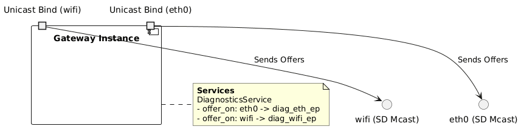
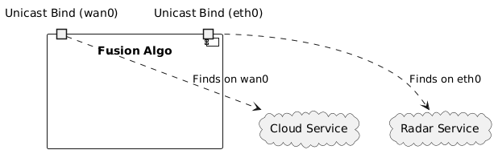
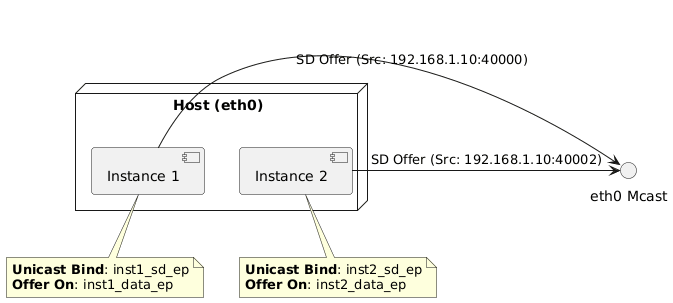
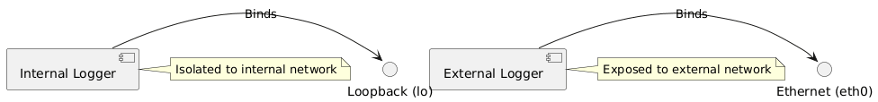
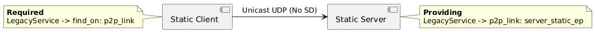
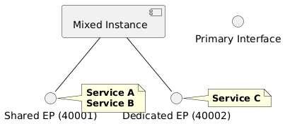
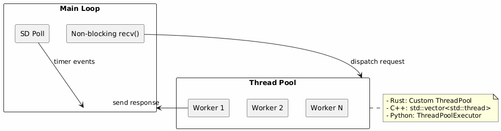

# Design & Requirements

> **See Also:** [Architecture](architecture.md) | [User Guide](user_guide.md) | [IDL Reference](IDL.md)

This document captures the design decisions and technical requirements for the Fusion Hawking SOME/IP stack, based on **AUTOSAR R22-11** (PRS_SOMEIPProtocol, PRS_SOMEIPServiceDiscoveryProtocol).

---

## 1. Objective

Introduce a **configuration-driven architecture** that decouples Service IDs, Instance IDs, Ports, and IP addresses from application code. This enables:
- Flexible deployment without recompilation
- Consistent topology across all language runtimes
- Resolution of "hardcoded port" mismatch issues

---

## 2. Configuration Schema

The system uses a **Interface-Centric, Instance-Bound** configuration model. This decouples the physical network topology (`interfaces`) from the application logic (`instances`), allowing flexible deployment.

### Schema Structure

The schema separates **Control Plane** (SD Unicast) from **Data Plane** (Service Endpoints).

- **Instance Level**: Defines which interfaces are used and their SD Unicast (Control) endpoints.
- **Service Level**: Defines which specific Data endpoints are used on those interfaces.

```json
{
  "interfaces": {
    "primary": {
      "name": "eth0",
      "endpoints": {
        "sd_control_ep": { "ip": "192.168.1.10", "port": 12345, "protocol": "udp", "version": 4 },
        "math_data_ep": { "ip": "192.168.1.11", "port": 40001, "protocol": "udp", "version": 4 },
        "string_data_ep": { "ip": "192.168.1.11", "port": 40002, "protocol": "udp", "version": 4 },
        "sd_multicast": { "ip": "239.255.0.1", "port": 30490, "protocol": "udp", "version": 4 }
      },
      "sd": {
        "endpoint": "sd_multicast"
      }
    }
  },
  "instances": {
    "my_instance": {
      // 1. Control Plane: Define Interfaces and their SD Unicast Bindings (Shared)
      "unicast_bind": {
        "primary": "sd_control_ep" 
      },
      
      "providing": {
        "MathService": {
          "service_id": 4660,
          "instance_id": 1,
          "major_version": 1,
          // 2. Data Plane: Map Interface -> Data Endpoint
          "offer_on": {
            "primary": "math_data_ep"
          }
        },
        "StringService": {
          "service_id": 4661,
          "instance_id": 1,
          "offer_on": {
            "primary": "string_data_ep"
          }
        }
      },
      "required": {
        "RemoteService": {
          "service_id": 5000,
          "find_on": ["primary"] 
        }
      }
    }
  }
}
```

### Key Components

| Component | Description |
|-----------|-------------|
| `interfaces` | Defines physical/virtual adapters and their named endpoints. |
| `instances` | Defines application runtime configurations. |
| `instances.unicast_bind` | **Control Plane**: Maps `Interface Name` → `SD Unicast Endpoint`. Shared by all services on that interface. |
| `providing` | Services offered. |
| `providing.offer_on` | **Data Plane**: Maps `Interface Name` → `Data Endpoint`. Specific to that service. |
| `required` | Services consumed. |
| `required.find_on` | List of interfaces to search for this service. |
| `sd.endpoint` | Multicast group used for Service Discovery on that interface. |

### Use Case Configuration Matrix

This schema supports complex deployment scenarios without code changes.

| Scenario | Config Strategy | Example Snippet |
| :--- | :--- | :--- |
| **Simple Server** | One instance, one interface. | `unicast_bind: { "primary": "ep1" }` |
| **Multi-Instance (Same Host)** | Two instances, same interface, different ports. | **Inst A**: `unicast_bind: { "primary": "ep_port_100" }`<br>**Inst B**: `unicast_bind: { "primary": "ep_port_101" }` |
| **Multi-Homed Provider** | One instance, providing on multiple interfaces. | `providing.SvcA.offer_on: { "eth0": "ep_eth", "wifi": "ep_wifi" }`<br>*(Instance binds to one primary IP, but offers Svc on both SD mcast groups)* |
| **Split Requirements** | Require `SvcA` on `eth0`, `SvcB` on `wifi`. | `required.SvcA.find_on: ["eth0"]`<br>`required.SvcB.find_on: ["wifi"]` |
| **Windows Loopback (Dev)** | Bind unicast `127.0.0.1`, RX Multicast `0.0.0.0`. | ** Implicit**: `fusion` tool injects hidden `_sd_bind` endpoint during runtime patch if loopback detected. User config remains clean. |
| **Container/Cloud** | Bind to `0.0.0.0` or specific POD IP. | Define `endpoint.ip`: "0.0.0.0" or inject via Env Vars. |

> **Note on Windows Loopback**: To receive multicast on Windows Loopback, the socket must bind to `0.0.0.0` or `::`. The `fusion` toolkit handles this automatically by injecting a shadow endpoint when it detects a Windows environment and a loopback interface, ensuring consistent behavior with Linux/macOS.

### 3. Configuration Use Case Examples

#### A. Multi-Homed Provider (Same Service, Multiple Interfaces)
A single instance offers the *same* service on both Ethernet and WiFi, using different data endpoints.



<details>
<summary>View PlantUML Source</summary>

[config_usecase_multi_homed.puml](diagrams/config_usecase_multi_homed.puml)
</details>

```json
{
  "instances": {
    "gateway_instance": {
      "unicast_bind": {
        "eth0": "gateway_sd_eth_ep",
        "wifi": "gateway_sd_wifi_ep"
      },
      "providing": {
        "DiagnosticsService": {
          "service_id": 0x1000,
          "offer_on": {
            "eth0": "diag_eth_ep",
            "wifi": "diag_wifi_ep"
          }
        }
      }
    }
  }
}
```

#### B. Complex Requirements (Services on Different Interfaces)
An instance requires `RadarService` from the high-speed bus (`eth0`) and `CloudService` from the external network (`wan0`).



<details>
<summary>View PlantUML Source</summary>

[config_usecase_complex_req.puml](diagrams/config_usecase_complex_req.puml)
</details>

```json
{
  "instances": {
    "fusion_algo": {
      "unicast_bind": { "eth0": "fusion_sd_ep", "wan0": "fusion_sd_wan_ep" },
      "required": {
        "RadarService": {
          "service_id": 0x2000,
          "find_on": ["eth0"]
        },
        "CloudService": {
          "service_id": 0x3000,
          "find_on": ["wan0"]
        }
      }
    }
  }
}
```

#### C. Multiple Instances (Same Interface)
Two instances of the same application running on the same host and interface (`eth0`). They must use distinct endpoints for both Control (SD) and Data to avoid port conflicts.



<details>
<summary>View PlantUML Source</summary>

[config_usecase_multi_inst_same_iface.puml](diagrams/config_usecase_multi_inst_same_iface.puml)
</details>

```json
{
  "interfaces": {
    "primary": {
      "endpoints": {
        "sd_mcast": { ... },
        // Instance 1 Endpoints
        "inst1_sd_ep": { "ip": "192.168.1.10", "port": 40000, ... },
        "inst1_data_ep": { "ip": "192.168.1.10", "port": 40001, ... },
        // Instance 2 Endpoints
        "inst2_sd_ep": { "ip": "192.168.1.10", "port": 40002, ... },
        "inst2_data_ep": { "ip": "192.168.1.10", "port": 40003, ... }
      },
      "sd": { "endpoint": "sd_mcast" }
    }
  },
  "instances": {
    "instance_1": {
      "unicast_bind": { "primary": "inst1_sd_ep" },
      "providing": {
        "ServiceA": {
          "service_id": 0x1000,
          "offer_on": { "primary": "inst1_data_ep" }
        }
      }
    },
    "instance_2": {
      "unicast_bind": { "primary": "inst2_sd_ep" },
      "providing": {
        "ServiceA": {
          "service_id": 0x1000,
          "offer_on": { "primary": "inst2_data_ep" }
        }
      }
    }
  }
}
```

#### D. Multiple Instances (Different Interfaces)
Two instances isolated to different networks.



<details>
<summary>View PlantUML Source</summary>

[config_usecase_multi_inst_diff_iface.puml](diagrams/config_usecase_multi_inst_diff_iface.puml)
</details>

```json
{
  "instances": {
    "internal_logger": {
      "unicast_bind": { "lo": "log_internal_ep" }
    },
    "external_logger": {
      "unicast_bind": { "eth0": "log_external_ep" }
    }
  }
}
```

#### E. Static Configuration (No Service Discovery)
Purely static addressing. No `sd` block in interface, no multicast. `unicast_bind` is omitted because there is no SD Control Plane.



<details>
<summary>View PlantUML Source</summary>

[config_usecase_static.puml](diagrams/config_usecase_static.puml)
</details>

```json
{
  "interfaces": {
    "p2p_link": {
      "name": "eth0",
      "endpoints": {
        "server_static_ep": { "ip": "192.168.1.50", "port": 5000, "protocol": "udp", "version": 4 },
        "client_static_ep": { "ip": "192.168.1.51", "port": 5000, "protocol": "udp", "version": 4 }
      }
      // Note: No "sd" block here
    }
  },
  "instances": {
    "static_server": {
      "providing": {
        "LegacyService": {
          "service_id": 0x9999,
          "offer_on": {
             "p2p_link": "server_static_ep"
          }
        }
      }
    },
    "static_client": {
      "required": {
        "LegacyService": {
          "service_id": 0x9999,
          "find_on": ["p2p_link"]
        }
      }
    }
  }
}
```

#### F. Shared vs Dedicated Data Endpoints
A single instance provides two services. `ServiceA` and `ServiceB` share an endpoint (bundled), while `ServiceC` uses a dedicated endpoint (isolated).



<details>
<summary>View PlantUML Source</summary>

[config_usecase_shared_dedicated.puml](diagrams/config_usecase_shared_dedicated.puml)
</details>

```json
{
  "instances": {
    "mixed_instance": {
      "unicast_bind": { "primary": "sd_ep" },
      "providing": {
        "ServiceA": {
          "service_id": 0x1000,
          "offer_on": { "primary": "shared_data_ep" }
        },
        "ServiceB": { // Shares endpoint with ServiceA
          "service_id": 0x2000,
          "offer_on": { "primary": "shared_data_ep" }
        },
        "ServiceC": { // Uses dedicated endpoint
          "service_id": 0x3000,
          "offer_on": { "primary": "dedicated_data_ep" }
        }
      }
    }
  }
}
```

```json
{
  "interfaces": {
    "p2p_link": {
      "name": "eth0",
      "endpoints": {
        "server_static_ep": { "ip": "192.168.1.50", "port": 5000, "protocol": "udp", "version": 4 },
        "client_static_ep": { "ip": "192.168.1.51", "port": 5000, "protocol": "udp", "version": 4 }
      }
      // Note: No "sd" block here
    }
  },
  "instances": {
    "static_server": {
      "providing": {
        "LegacyService": {
          "service_id": 0x9999,
          "offer_on": {
             "p2p_link": "server_static_ep"
          }
        }
      }
    },
    "static_client": {
      "required": {
        "LegacyService": {
          "service_id": 0x9999,
          "find_on": ["p2p_link"]
        }
      }
    }
  }
}
```

---

## 4. Protocol Compliance (PRS_SOMEIPSD)

Fusion Hawking strictly adheres to the AUTOSAR Service Discovery specification [PRS_SOMEIPSD_00280] regarding option lengths.

**Length Field Interpretation:**
The `Length` field in SD Header Options (IPv4/IPv6 Endpoints) indicates the number of bytes **excluding** the `Type` field.

| Option Type | Payload Size | PRS Length Field |
|-------------|--------------|------------------|
| IPv4 Endpoint (0x04) | 9 bytes | **0x0009** |
| IPv6 Endpoint (0x06) | 21 bytes | **0x0015** |

Runtimes utilize a total parsing stride of `3 + Length` (1 byte Type + 2 bytes Length field + data).

> **Deployment Diagram:** See [Architecture - Deployment Topology](architecture.md#deployment-topology)

---

## 3. Logging Abstraction (DLT-Ready)

All runtimes implement a pluggable logger for future DLT (Diagnostic Log and Trace) integration:

| Language | Interface | Injection Point |
|----------|-----------|-----------------|
| Rust | `trait FusionLogger` | Via builder or `with_logger()` |
| Python | `class ILogger` | Constructor parameter |
| C++ | `class ILogger` | Constructor parameter |

```rust
// Rust trait
pub trait FusionLogger: Send + Sync {
    fn log(&self, level: LogLevel, component: &str, msg: &str);
}
```

```cpp
// C++ interface
class ILogger {
public:
    virtual void Log(LogLevel level, const char* comp, const char* msg) = 0;
};
```

---

## 4. IPv6 Support

Configuration auto-detects IP version from address format:

```json
"multicast": {
  "ip": "ff14::1",
  "port": 30490
}
```

**Implementation:**
- Socket creation uses `AF_INET6` when address contains `:`
- SD Endpoint Option selects IPv4 (0x04) or IPv6 (0x06) accordingly

> **Feature Matrix:** See [Test Matrix](test_matrix.md#feature-coverage) for IPv6 support status.

---

## 5. Concurrency Model



<details>
<summary>View PlantUML Source</summary>

[concurrency_model.puml](diagrams/concurrency_model.puml)
</details>

**Key Principles:**
- All sockets set to non-blocking
- Handlers execute in thread pool (don't block reactor)
- Callbacks follow `on_message(service, result)` pattern

---

## 6. Dependency Management

| Language | Dependencies | Notes |
|----------|--------------|-------|
| Rust | `serde`, `serde_json` | Standard ecosystem, statically linked |
| C++ | None | Custom header-only JSON parser |
| Python | None | Standard library only (`json`, `socket`, `threading`) |

**Rule:** No OS-level package installs required.

---

## 7. Testing Strategy

### Unit Tests
- Configuration loading and parsing
- Codec serialization roundtrip
- SD state machine transitions

### Integration Matrix

| Client | Server | Protocol | Status |
|--------|--------|----------|--------|
| Python | Rust | IPv4 | ✅ |
| Rust | C++ | IPv4 | ✅ |
| C++ | Python | IPv6 | ✅ |

> **Full Matrix:** See [Test Matrix](test_matrix.md)

### Fault Injection
- Unreachable config targets
- Malformed packets
- TTL expiry

---

## 8. Migration Path

For projects adopting Fusion Hawking:

1. **Create `config.json`** with your topology
2. **Update runtime initialization** to use config:
   ```rust
   // Before
   let rt = SomeIpRuntime::new(30509);
   // After  
   let rt = SomeIpRuntime::load("config.json", "my-instance");
   ```
3. **Replace hardcoded IDs** with config aliases:
   ```rust
   rt.offer_service("math-service", handler);  // Uses config lookup
   ```

> **API Examples:** See [User Guide - Runtime API](user_guide.md#runtime-api)

---

## References

- [Architecture Document](architecture.md) - Visual diagrams and layer details
- [User Guide](user_guide.md) - Day-to-day usage
- [IDL Documentation](IDL.md) - Type system and code generation
- [Test Matrix](test_matrix.md) - Coverage and verification status
