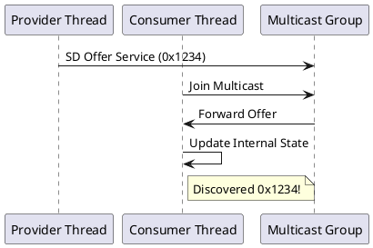
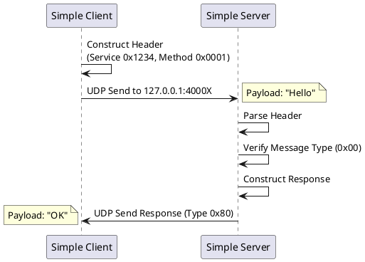
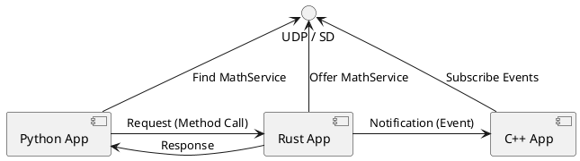

# Fusion Hawking Examples

This directory contains examples demonstrating how to use the `fusion-hawking` SOME/IP stack. The examples are categorized into three levels of complexity.

## Directory Structure

```
examples/
├── sd_demos/           # 1. Raw Service Discovery Logic
├── simple_no_sd/       # 2. Minimal Wire-Protocol (No SD)
│   ├── rust/
│   ├── python/
│   └── cpp/
└── integrated_apps/    # 3. Full Runtime Integration
    ├── rust_app/
    ├── python_app/
    └── cpp_app/
```

---

## 1. Raw Service Discovery (`sd_demos/`)
**Purpose**: To demonstrate the Service Discovery State Machine in isolation.
- `sd_demo.rs`: A single Rust binary that spawns a **Provider** thread and a **Consumer** thread. They discover each other via Multicast UDP (`224.0.0.1:30490`).



---

## 2. Simple No-SD (`simple_no_sd/`)
**Purpose**: To demonstrate the "Under the Hood" wire protocol **without** the complexity of the Runtime or Service Discovery.
These examples manually construct the **16-byte SOME/IP Header** and send raw UDP packets to fixed ports (Localhost).

- **Rust**: `rust/server.rs` (Port 40000) & `rust/client.rs`
- **Python**: `python/server.py` (Port 40001) & `python/client.py`
- **C++**: `cpp/server.cpp` (Port 40002) & `cpp/client.cpp`

**Key Concepts**:
- Manually packing bytes (Big Endian).
- Handling Request (0x00) and Response (0x80) Message Types.
- No config files, no discovery delays.



---

## 3. Integrated Apps (`integrated_apps/`)
**Purpose**: To demonstrate the full **Production-Ready** usage of the library.
These apps use the `SomeIpRuntime`, which handles:
- **Configuration Loading** (`config.json`).
- **Service Discovery** (Auto-discovery of peers).
- **Code Generation** (Typed Interfaces).

### Configuration (`config.json`)
The `config.json` defines the network topology.
```json
{
  "instances": {
    "rust_app_instance": { "ip": "127.0.0.1", "providing": { ... } },
    "python_app_instance": { "required": { "math-service": { ... } } }
  }
}
```

### Code Generation
To develop these apps, we first generate bindings from an IDL using the `codegen` tool.

**Usage**:
```bash
# Generate Rust Bindings
cargo run --bin codegen -- --idl interface.json --lang rust --out src/generated

# Generate Python Bindings
cargo run --bin codegen -- --idl interface.json --lang python --out src/python/generated
```

**Architecture**:



## Previewing Diagrams
To view the PlantUML diagrams in VS Code:
1. Install the **PlantUML** extension (by Jebbs).
2. Open this file.
3. Press `Alt+D` to toggle the preview.
