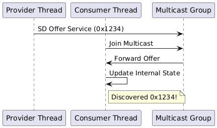
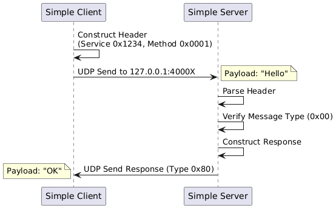
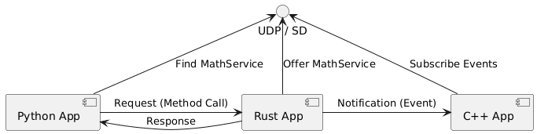

This directory contains examples demonstrating how to use the `fusion-hawking` SOME/IP stack. The examples are categorized into four levels of complexity and showcase cross-language communication between Rust, Python, C++, and JavaScript/TypeScript.

## Directory Structure

```
examples/
├── sd_demos/           # 1. Raw Service Discovery Logic
├── simple_no_sd/       # 2. Minimal Wire-Protocol (No SD)
│   ├── rust/
│   ├── python/
│   ├── cpp/
│   └── js/             # Pure TS implementation
├── integrated_apps/    # 3. Full Runtime Integration (RPC)
│   ├── rust_app/
│   ├── python_app/
│   ├── cpp_app/
│   └── js_app/         # Node.js implementation
├── automotive_pubsub/  # 4. Automotive Pub-Sub Pattern
└── someipy_demo/       # 5. External Interop (someipy)
```

---

## 1. Raw Service Discovery (`sd_demos/`)
**Purpose**: To demonstrate the Service Discovery State Machine in isolation.
- `sd_demo.rs`: A single Rust binary that spawns a **Provider** thread and a **Consumer** thread. They discover each other via Multicast UDP (`224.0.0.1:30490` by default).



<details>
<summary>View PlantUML Source</summary>

[sd_demo_sequence.puml](../docs/diagrams/sd_demo_sequence.puml)
</details>

---

## 2. Simple No-SD (`simple_no_sd/`)
**Purpose**: To demonstrate the "Under the Hood" wire protocol **without** the complexity of the Runtime or Service Discovery.
These examples manually construct the **16-byte SOME/IP Header** and send raw UDP packets to fixed ports (Localhost).

- **Rust**: `rust/server.rs` (Port 40000) & `rust/client.rs`
- **Python**: `python/server.py` (Port 40001) & `python/client.py`
- **C++**: `cpp/server.cpp` (Port 40002) & `cpp/client.cpp`
- **JS/TS**: `js/server.ts` & `js/client.ts`



<details>
<summary>View PlantUML Source</summary>

[simple_no_sd_sequence.puml](../docs/diagrams/simple_no_sd_sequence.puml)
</details>

---

## 3. Integrated Apps (`integrated_apps/`)
**Purpose**: To demonstrate the full **Production-Ready** usage of the library.
These apps use the `SomeIpRuntime`, which handles:
- **Interface-Centric Configuration** (`config.json`).
- **Service Discovery** (Multi-interface discovery).
- **Code Generation** (Typed Interfaces).

This demo leverages **Rust, Python, C++, and JavaScript/TypeScript** running concurrently to provide and consume services.

### Configuration (`config.json`)
The `config.json` defines the network topology per interface.
```json
{
  "interfaces": {
    "lo": {
      "name": "lo",
      "sd": { "endpoint_v4": "sd_mcast" },
      "endpoints": {
        "sd_mcast": { "ip": "224.0.0.1", "port": 30490, "version": 4 },
        "service_ep": { "ip": "127.0.0.1", "port": 40001, "version": 4 }
      }
    }
  },
  "instances": {
    "python_app": {
      "providing": {
        "math-service": { "service_id": 4660, "endpoint": "service_ep", "interfaces": ["lo"] }
      }
    }
  }
}
```

### Code Generation
To develop these apps, we first generate bindings from an IDL using the `codegen` tool.

**Usage**:
```bash
# Generate bindings for ALL supported languages
python -m tools.codegen.main interface.py --all
```

**Architecture**:



<details>
<summary>View PlantUML Source</summary>

[integrated_apps_interaction.puml](../docs/diagrams/integrated_apps_interaction.puml)
</details>
---

## 4. Automotive Pub-Sub (`automotive_pubsub/`)
**Purpose**: The primary **cross-language showcase** demonstrating the publish-subscribe pattern with SOME/IP events.

This example shows a realistic automotive data flow involving **all supported languages (Rust, C++, Python, JS/TS)**:
- **RadarService** (C++): Publishes radar object detections at 10Hz
- **FusionService** (Rust): Subscribes to radar, publishes fused tracks
- **ADAS App** (Python/JS): Subscribes to fusion events, logs warnings

**Key APIs**:
- `@event` decorator for defining events in IDL
- `subscribe_eventgroup()` to subscribe to events
- `SendNotification()` to publish events

See [automotive_pubsub/README.md](automotive_pubsub/README.md) for detailed instructions.

---

## 5. External Interop (`someipy_demo/`)
**Purpose**: To demonstrate interoperability between the Fusion Hawking stack and external SOME/IP implementations.
This example uses the `someipy` Python library as an external service provider:
- **someipy Service**: Provides an `Echo` method (0x1234:0x0001).
- **Fusion Clients**: C++, Rust, and Python clients connect to the `someipy` service.

**Key Concepts**:
- Cross-implementation discovery.
- Port isolation for standard-compliant interop.
- Using third-party libraries without project-level modifications.

See [someipy_demo/README.md](someipy_demo/README.md) for detailed instructions.

---

## 6. Versioning Demo (`versioning_demo/`)
**Purpose**: To demonstrate support for multiple versions of the same service running simultaneously.
- **Server V1**: Offers `IVersionedService` v1 (0x2000, Major 1).
- **Server V2**: Offers `IVersionedService` v2 (0x2000, Major 2).
- **Client**: Connects to both versions simultaneously using `(ServiceId, MajorVersion)` lookup.

**Key Concepts**:
- Runtime support for Major Versioning in Service Discovery.
- Configuration-based version mapping.

## 7. IDL Demo (`idl_demo.py`)
**Purpose**: A standalone script to demonstrate the Code Generation and Serialization capabilities without running a full network stack.
- Generates Python bindings from `examples/map_service.py`.
- Demonstrates serialization/deserialization of complex nested structs.
- Shows the conceptual Synchronous RPC pattern.


---

## Previewing Diagrams
To view the PlantUML diagrams in VS Code:
1. Install the **PlantUML** extension (by Jebbs).
2. Open this file.
3. Press `Alt+D` to toggle the preview.
