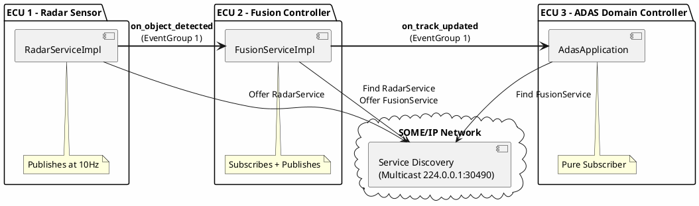
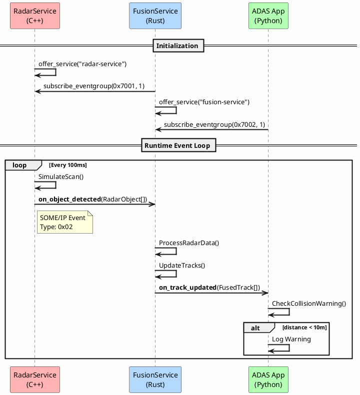
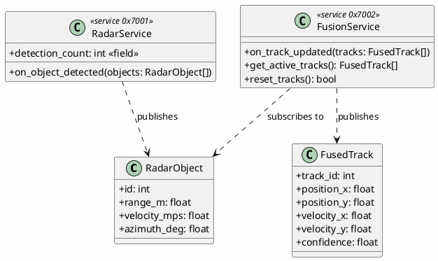

# Automotive Publish-Subscribe Demo

This example demonstrates the **publish-subscribe** communication pattern using SOME/IP events, inspired by automotive middleware patterns.

> **Disclaimer**: This is an independent, open-source implementation demonstrating common automotive communication patterns. It is not affiliated with, endorsed by, or derived from any proprietary automotive standard or specification. All code is original work licensed under MIT.

## License

SPDX-License-Identifier: MIT

## Architecture Overview

This demo simulates a realistic autonomous driving perception pipeline:

```
┌─────────────────┐       ┌─────────────────┐       ┌─────────────────┐
│   RadarService  │       │ FusionService   │       │   ADAS App      │
│     (C++)       │──────▶│     (Rust)      │──────▶│    (Python)     │
│   [Publisher]   │ Event │ [Sub + Pub]     │ Event │  [Subscriber]   │
└─────────────────┘       └─────────────────┘       └─────────────────┘
     Port 30601                Port 30602
```

**Data Flow:**
1. **RadarService** (C++): Simulates radar sensor, publishes `on_object_detected` events at 10Hz
2. **FusionService** (Rust): Subscribes to radar events, fuses data, publishes `on_track_updated`
3. **ADAS App** (Python): Subscribes to fusion events, logs collision warnings

---

## Design: SOME/IP Event Architecture



---

## Sequence Diagram: Event Flow



---

## Data Types



---

## Key APIs Demonstrated

| API | Language | Purpose |
|-----|----------|---------|
| `SendNotification()` | C++ | Publish an event to subscribers |
| `subscribe_eventgroup()` | Rust/Python | Subscribe to an event group |
| `unsubscribe_eventgroup()` | Rust/Python | Unsubscribe from events |
| `@event` decorator | Python IDL | Define an event in the interface |
| `@field` decorator | Python IDL | Define a field with notifier |

---

## Automotive Communication Concepts

| Concept | SOME/IP Equivalent |
|--------------------|--------------------|
| **Sender/Receiver** | Service with Events |
| **Message (PDU)** | SOME/IP Message Payload |
| **Signal** | Event Data (serialized struct) |
| **Event Subscription** | `subscribe_eventgroup()` |
| **Event Notification** | SOME/IP Event Message (Type 0x02) |
| **Event Group** | Collection of related events |

---

## Running the Demo

### 1. Generate Bindings
```bash
# Generate bindings for all languages
python -m tools.codegen.main --idl examples/automotive_pubsub/interface.py --all
```

### 2. Build
```bash
# Build Rust
cargo build --release

# Build C++
cmake --build build --target radar_demo
```

### 3. Run (3 terminals)

**Terminal 1 - Radar (C++):**
```bash
.\build\radar_demo.exe
```

**Terminal 2 - Fusion (Rust):**
```bash
cargo run --bin fusion_node
```

**Terminal 3 - ADAS (Python):**
```bash
python examples/automotive_pubsub/python_adas/main.py
```

### 4. Automated (via fusion.bat)
```bash
.\fusion.bat
```
The demo is automatically run as part of the integration test suite.

---

## Expected Output

**Radar (C++):**
```
=== Radar Publisher Demo (C++) ===
[INFO] RadarService: Publishing 3 objects (total: 3)
[INFO] RadarService: Publishing 4 objects (total: 7)
```

**Fusion (Rust):**
```
=== Fusion Node Demo (Rust) ===
[INFO] FusionService: Fused 3 tracks from radar data
[INFO] FusionService: Publishing 3 fused tracks
```

**ADAS (Python):**
```
=== ADAS Application Demo (Python) ===
[INFO] ADAS: Received 3 fused tracks (total: 3)
[WARN] ADAS: ** COLLISION WARNING: Track 0 at 8.5m! **
```

---

## Files

| File | Description |
|------|-------------|
| `interface.py` | Service definitions (RadarService, FusionService) |
| `config.json` | Network configuration for all 3 nodes |
| `cpp_radar/main.cpp` | C++ radar publisher |
| `rust_fusion/main.rs` | Rust fusion node (sub + pub) |
| `python_adas/main.py` | Python ADAS subscriber |

## Previewing Diagrams

To view the PlantUML diagrams in VS Code:
1. Install the **PlantUML** extension (by Jebbs).
2. Open this file.
3. Press `Alt+D` to toggle the preview.
