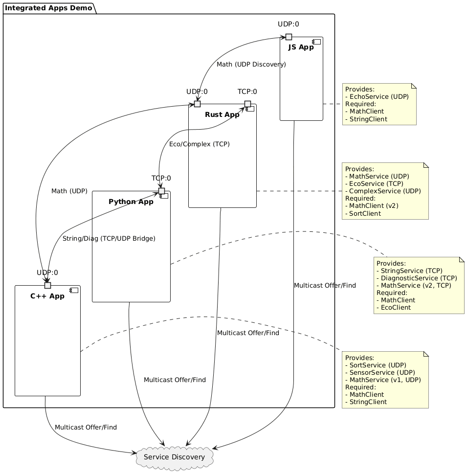
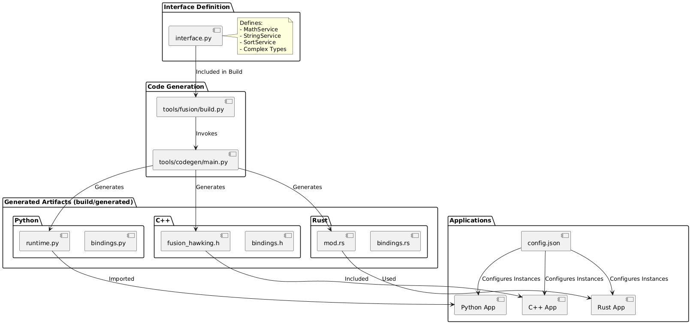

# Integrated Apps Demo (Polyglot)

This is the flagship demo of the Fusion framework, showcasing a complex microservices architecture spanning Python, C++, and Rust.

## Architecture



## Build Workflow

This diagram shows how the IDL (`interface.py`) transforms into the code used by the applications:



## Components

-   **Rust App** (`examples/integrated_apps/rust_app`): High-performance backend services.
-   **Python App** (`examples/integrated_apps/python_app`): Scripting and coordination.
-   **C++ App** (`examples/integrated_apps/cpp_app`): Legacy integration or high-performance compute.
-   **JS App** (`examples/integrated_apps/js_app`): Web/Node.js visualization or gateway services.

## Running the Demo

The entire system can be launched using the main runner script:

```bash
python examples/integrated_apps/run.py
```

This script orchestrates all three applications, handles their output, and ensures clean shutdown.
