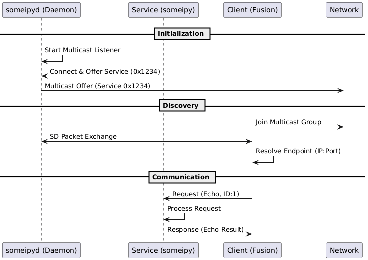
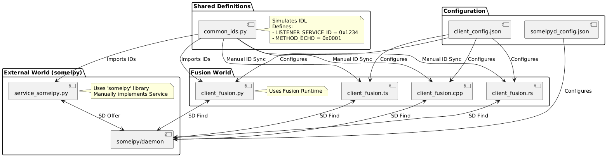

# Multi-Language SOME/IP Demo (someipy + Fusion)

This demo showcases interoperability between the external `someipy` implementation and the internal Fusion (Python, C++, Rust) implementations.

## Overview



## Integration & Data Flow

This diagram shows how the external `someipy` service integrates with Fusion clients using shared ID definitions:



- **Service Provider**: `service_someipy.py` (using `someipy` library)
  - **Service ID**: 0x1234
  - **Instance ID**: 0x0001
  - **Method**: Echo (0x0001)
- **Clients**:
  - `client_fusion.py` (Fusion Python)
  - `client_fusion.cpp` (Fusion C++)
  - `client_fusion.rs` (Fusion Rust)

## Prerequisites

1.  Python 3.8+
2.  `someipy` dependencies (usually just standard lib, but requires `someipyd.py` daemon)
3.  C++ Compiler (for C++ client)
4.  Rust / Cargo (for Rust client)

## Running the Demo

### 1. Start the someipy Daemon
Open a terminal and run:
```bash
python examples/someipy_demo/start_daemon.py
```

### 2. Start the someipy Service
Open another terminal and run:
```bash
python examples/someipy_demo/service_someipy.py
```

### 3. Run Fusion Clients

#### Python Client
```bash
$env:PYTHONPATH="src/python"
python examples/someipy_demo/client_fusion.py
```

#### C++ Client
First, build the project if not already built.
```bash
mkdir build; cd build; cmake ..; cmake --build .
./examples/someipy_demo/client_fusion
```

#### Rust Client
```bash
cargo run --bin someipy_client
```

## How it works

1.  The `someipyd.py` daemon handles SOME/IP Service Discovery (SD).
2.  The `service_someipy.py` connects to the daemon and offers the Echo service.
3.  Fusion clients (Python, C++, Rust) use their respective SD implementations to discover the service offered on 127.0.0.1:30001.
4.  Once discovered, each client sends an Echo request and prints the response.
