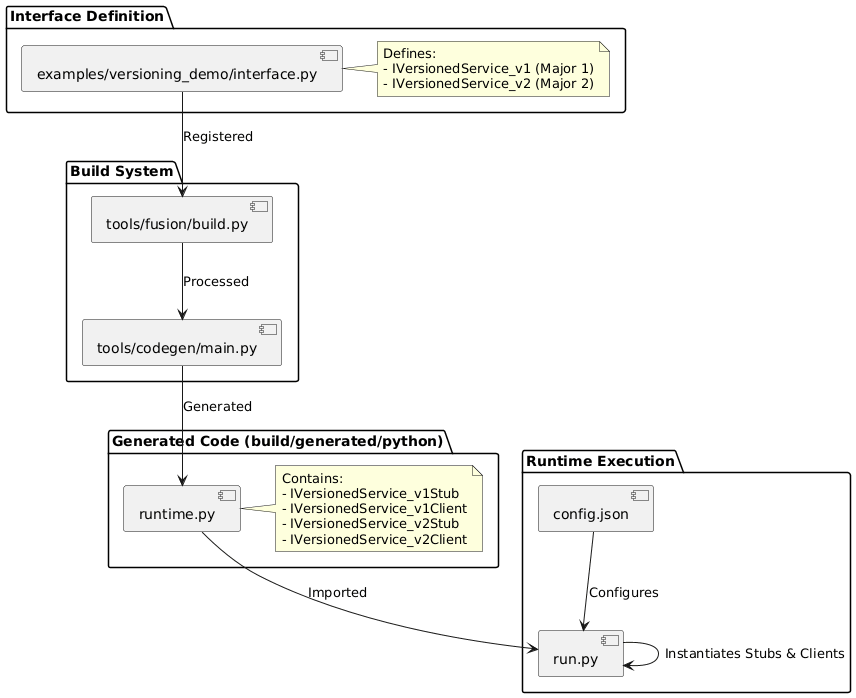

# Versioning Demo

This demo illustrates how Fusion supports multiple versions of the same service interface coexisting on the network.

## Sequence Diagram


## Development Workflow

This diagram illustrates how the versioned interfaces are generated and used:



## Overview

- **Interface**: `IVersionedService` (Service ID: `0x2000`)
- **Server V1**: Offers `IVersionedService` Version 1.0 (Major 1).
- **Server V2**: Offers `IVersionedService` Version 2.0 (Major 2).
- **Client**: Connects to both V1 and V2 simultaneousy using `(ServiceId, MajorVersion)` lookup.

## Running the Demo

1.  **Start Server V1**:
    ```bash
    python run.py server_v1
    ```

2.  **Start Server V2**:
    ```bash
    python run.py server_v2
    ```

3.  **Run Client**:
    ```bash
    python run.py client
    ```

The client will discover both services and invoke the appropriate method version (`method_v1` or `method_v2`) on each.
